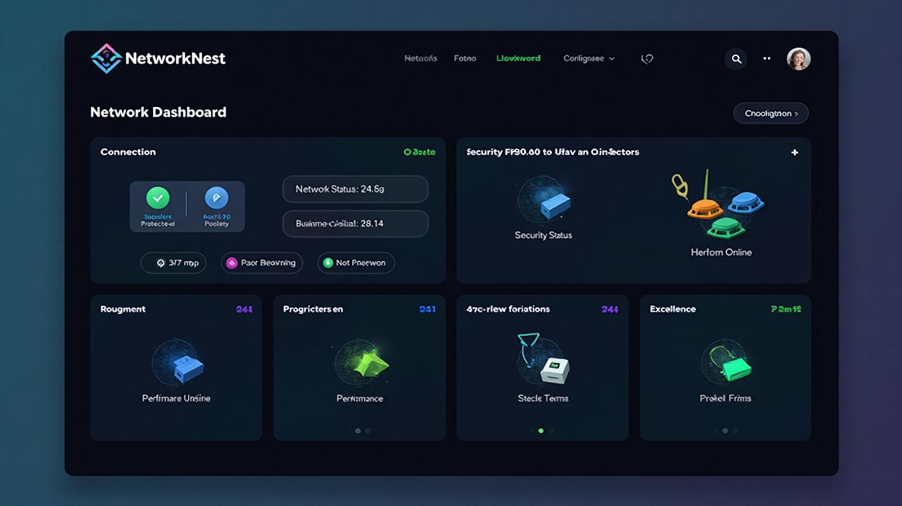
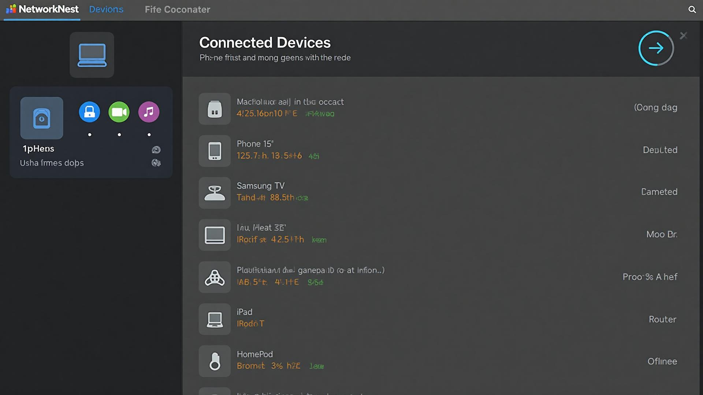
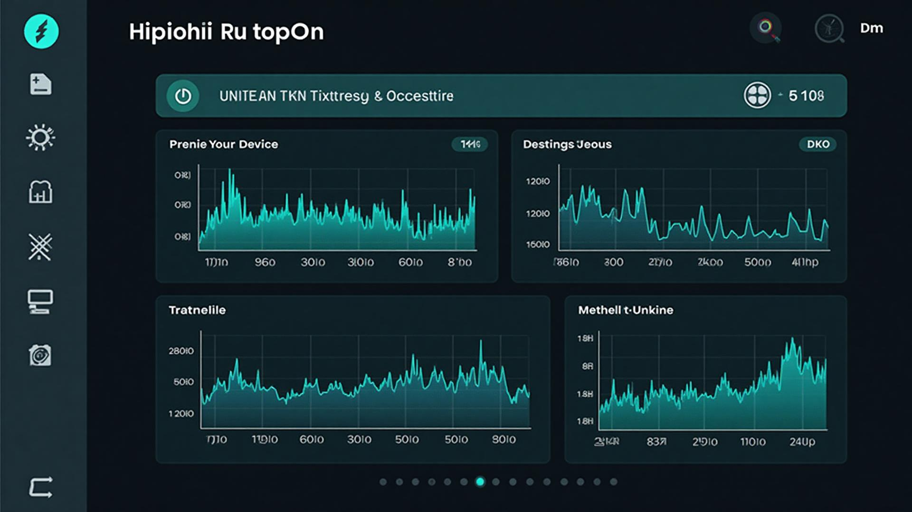
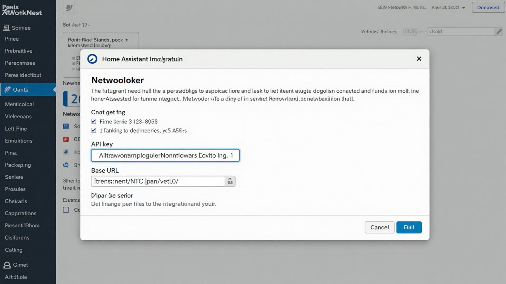
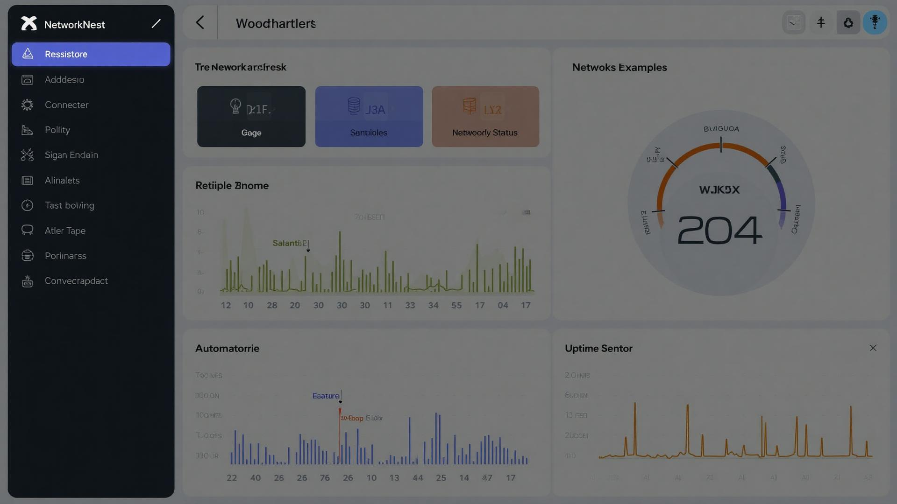

# NetworkNest - Network Monitoring Dashboard

A modern, comprehensive network monitoring solution with Home Assistant integration, featuring real-time 3D visualizations and detailed analytics.

## 📸 Screenshots

### 🌐 Main Network Dashboard
*Real-time 3D network visualization with live metrics*



**Key Features Shown:**
- 🎯 **3D Network Topology** - Interactive 3D visualization of your network infrastructure
- 📊 **Real-time Metrics** - Live bandwidth usage, connected devices, and network status
- 🎨 **Modern UI** - Dark theme with glassmorphism effects and intuitive navigation
- 📱 **Responsive Design** - Works seamlessly across all device sizes

---

### 🖥️ Device Monitoring Grid
*Comprehensive device management and monitoring*



**Key Features Shown:**
- 🔧 **Device Cards** - Visual representation of routers, switches, and access points
- 📈 **Performance Metrics** - CPU, memory, and bandwidth usage for each device
- 🟢 **Status Indicators** - Real-time health status with color-coded alerts
- ⚙️ **Management Tools** - Quick access to device configuration and controls

---

### 📊 Analytics & History
*Detailed monitoring history with interactive charts*



**Key Features Shown:**
- 📈 **Interactive Charts** - Bandwidth trends, device connections over time
- 🔍 **Historical Data** - Comprehensive monitoring history and analytics
- 📋 **Data Export** - Export monitoring data for external analysis
- 🎛️ **Custom Timeframes** - Filter data by specific date ranges and intervals

---

### 🏠 Home Assistant Setup
*Seamless integration with Home Assistant*



**Key Features Shown:**
- 🔐 **Easy Configuration** - Simple API key and URL setup process
- ✅ **Validation** - Real-time connection testing and validation
- 📚 **Setup Guide** - Step-by-step instructions for quick configuration
- 🔄 **Auto-Discovery** - Automatic device and sensor registration

---

### 🏡 Home Assistant Dashboard
*NetworkNest sensors in your Home Assistant dashboard*



**Key Features Shown:**
- 📊 **Bandwidth Gauge** - Real-time network speed monitoring
- 📱 **Device Counter** - Track connected devices on your network
- 🌐 **Status Sensors** - Network connectivity and uptime monitoring
- 🤖 **Automation Ready** - Use network data in your HA automations

---

## 🌟 Features

### Web Dashboard
- **3D Network Visualization**: Beautiful 3D icons and interactive network topology
- **Real-time Monitoring**: Live bandwidth, device status, and network health metrics
- **Historical Analytics**: Detailed monitoring history with interactive charts
- **Device Management**: Monitor routers, switches, access points, and custom devices
- **Service Monitoring**: HTTP/HTTPS, TCP/UDP, ping, DNS, Docker, SQL, MQTT monitoring
- **Responsive Design**: Works perfectly on desktop and mobile devices

### Home Assistant Integration
- **Native HA Integration**: Install via HACS or manually
- **Real-time Sensors**: Bandwidth, connected devices, network status, uptime
- **Device Discovery**: Automatic device registration in Home Assistant
- **Automation Ready**: Use network data in your Home Assistant automations
- **Dashboard Cards**: Pre-built cards for Home Assistant dashboards

### Technical Features
- **Supabase Backend**: Scalable database with real-time updates
- **Authentication**: Secure user management and API access
- **Edge Functions**: High-performance serverless API endpoints
- **TypeScript**: Type-safe development with modern React
- **Tailwind CSS**: Beautiful, responsive design system

## 🚀 Quick Start

### Deploy the Web App

1. **Clone this repository**
   ```bash
   git clone https://github.com/YOUR_USERNAME/networknest.git
   cd networknest
   ```

2. **Set up Supabase**
   - Create a new Supabase project
   - Run the included migrations
   - Configure authentication

3. **Deploy**
   - Deploy to Vercel, Netlify, or your preferred platform
   - The app will automatically connect to your Supabase instance

### Install Home Assistant Integration

#### Via HACS (Recommended)

1. Add this repository as a custom HACS repository
2. Install "NetworkNest" from HACS
3. Restart Home Assistant
4. Add the integration via Settings → Devices & Services

#### Manual Installation

1. Download the `custom_components/networknest` folder
2. Copy to your Home Assistant `custom_components` directory
3. Restart Home Assistant
4. Add the integration via Settings → Devices & Services

## 📖 Documentation

- [Installation Guide](HACS_INSTALLATION.md) - Detailed setup instructions
- [Configuration](docs/configuration.md) - Complete configuration guide
- [API Reference](docs/api.md) - Edge function API documentation
- [Troubleshooting](docs/troubleshooting.md) - Common issues and solutions

## 🛠️ Development

### Prerequisites
- Node.js 18+
- Supabase CLI
- Home Assistant (for testing integration)

### Setup Development Environment

1. **Install dependencies**
   ```bash
   npm install
   ```

2. **Start Supabase locally**
   ```bash
   supabase start
   ```

3. **Run development server**
   ```bash
   npm run dev
   ```

4. **Test Home Assistant integration**
   ```bash
   # Copy integration to HA config
   cp -r custom_components/networknest /path/to/homeassistant/custom_components/
   ```

### Project Structure

```
networknest/
├── src/                          # React web application
│   ├── components/              # UI components
│   ├── pages/                   # Page components
│   └── integrations/            # Supabase integration
├── custom_components/           # Home Assistant integration
│   └── networknest/            # HA integration code
├── supabase/                    # Backend configuration
│   ├── functions/              # Edge functions
│   └── migrations/             # Database migrations
└── public/                      # Static assets
    └── homeassistant/          # HA manifest and assets
```

## 🏠 Home Assistant Integration

### Sensors Created

- `sensor.network_bandwidth` - Real-time bandwidth usage (Mbps)
- `sensor.connected_devices` - Number of connected devices
- `sensor.network_status` - Network connectivity status (online/offline)
- `sensor.network_uptime` - Network uptime in hours

### Example Automations

```yaml
# Network down alert
automation:
  - alias: "Network Down Alert"
    trigger:
      platform: state
      entity_id: sensor.network_status
      to: "offline"
    action:
      service: notify.mobile_app_your_phone
      data:
        message: "🚨 Network is down!"

# High bandwidth usage alert
automation:
  - alias: "High Bandwidth Alert"
    trigger:
      platform: numeric_state
      entity_id: sensor.network_bandwidth
      above: 800
    action:
      service: notify.mobile_app_your_phone
      data:
        message: "⚠️ High bandwidth usage: {{ states('sensor.network_bandwidth') }} Mbps"
```

### Dashboard Cards

```yaml
# Network status card
type: entities
entities:
  - sensor.network_status
  - sensor.connected_devices
  - sensor.network_bandwidth
  - sensor.network_uptime
title: Network Status

# Bandwidth gauge
type: gauge
entity: sensor.network_bandwidth
name: Bandwidth Usage
unit: Mbps
min: 0
max: 1000
severity:
  green: 0
  yellow: 500
  red: 800
```

## 🤝 Contributing

We welcome contributions! Please see our [Contributing Guide](CONTRIBUTING.md) for details.

### Areas for Contribution
- Additional device type support
- New monitoring protocols
- Enhanced visualizations
- Documentation improvements
- Bug fixes and optimizations

## 📄 License

This project is licensed under the MIT License - see the [LICENSE](LICENSE) file for details.

## 🆘 Support

- 📖 [Documentation](https://github.com/YOUR_USERNAME/networknest)
- 🐛 [Report Issues](https://github.com/YOUR_USERNAME/networknest/issues)
- 💬 [Discussions](https://github.com/YOUR_USERNAME/networknest/discussions)
- 📧 [Email Support](mailto:support@networknest.dev)

## 🎯 Roadmap

- [ ] Mobile app companion
- [ ] Advanced alerting system
- [ ] Multi-site monitoring
- [ ] Custom dashboard themes
- [ ] API rate limiting and quotas
- [ ] Advanced device discovery
- [ ] Network topology mapping
- [ ] Performance benchmarking

---

**NetworkNest** - Making network monitoring beautiful and accessible for everyone.
